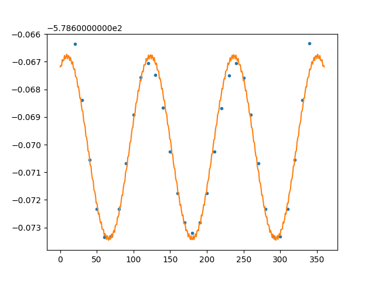

Использовал scipy.optimize.curve_fit

Чтобы сходилось лучше нужно использовать key p0 = []

Крайние точки выбиваются, т.к. амплитуда по краям больше, чем в середине. Можно откинуть правые и левые две точки.

Пример скрипта:

```python
rom scipy.optimize import curve_fit
import matplotlib.pyplot as plt

def func(x, a, b, c, d, e, f, g):
    return a * np.sin(b * x + c) + d * np.sin(e * x + f) + g


degree, energy = np.array([]), np.array([])
with open("ccccl.relaxscanact.dat", "r") as file:
    for line in file:
        deg, en = map(float, line.split())
        degree = np.append(degree, deg)
        energy = np.append(energy, en)
    
    xfine = np.linspace(degree.min(), degree.max(), 360)
    degree = degree[2:-2]
    energy = energy[2:-2]
    
		#p0 подобран для CCCCl
    popt, pcov = curve_fit(func, degree, energy, p0 = [-0.003, 0.05, -2.09, 0.0001, 2.31, -2.55, -578.67])
    
    plt.plot(degree, energy, '.')
    plt.plot(xfine, func(xfine, popt[0], popt[1], popt[2], popt[3], popt[4], popt[5], popt[6]))
    plt.show()
```

