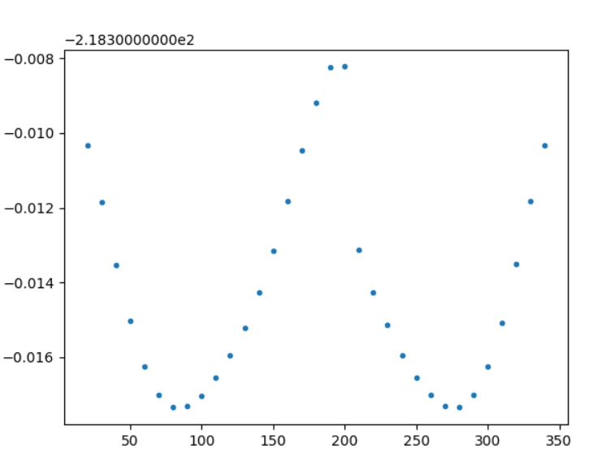
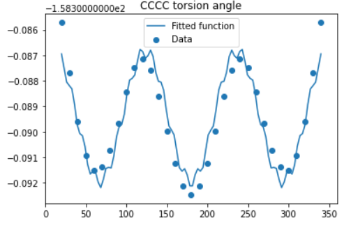

Понял, какой торсионник нужно считать, посчитал для CCCCl.

Orca на выходе дает два файла с энергиями(SCF energy & Actual Energy), нам нужен второй. 

Аппроксимировать будем при помощи scipy функцией вида $f(x) = A_1sin(B_1 * x + C_1) + A_2sin(B_2 * x + C_2) + D$

[Аппроксимация](scans/approx)

При подсчете CCCF возникла проблема. Получаем набор точек вида:

Видно, что выбиваются точки. Открыл в Сhemcraft, видно, что он делает отдельны молекулы. С CCCC то же самое. Проблема оказалась в том, что он начинал оптимизировать молекулу на первом шаге, в которой угол был не 0. В Chemсraft поставил градус 0, запустил расчет, все получилось.

Для аппроксимации CCCC получим:

Скорее всего просто суммы двух синусов будет недостаточно для описания, т.к. минимум на 180 градусах очевидно меньше, чем на 60 и 300. Решение: полсе изучения литературы (Циррельсон), было решено представлять энергию в виде функции: ;f(x) = A \cdot cos(x) + B \cdot cos(2x) + C \cdot cos(3x) + D$

### Коэффициенты:

| Coefficints | CCCC         | CCCF         | CCCCl        |
| ----------- | ------------ | ------------ | ------------ |
| A           | 0.001422784  | 0.0004826106 | 0.0009682769 |
| B           | 0.0007348887 | 0.0005669827 | 0.0009307197 |
| C           | 0.002960117  | 0.00319179   | 0.003570084  |
| D           | -158.389     | -218.3295    | -578.6697    |
| RMSE        | 0.000176043  | 0.0001423509 | 0.0000800934 |

### [Графики](scans/plots)

