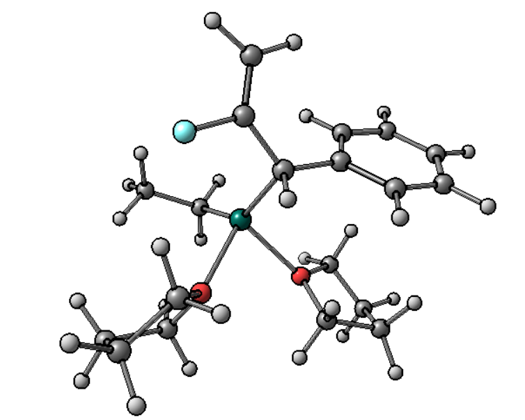
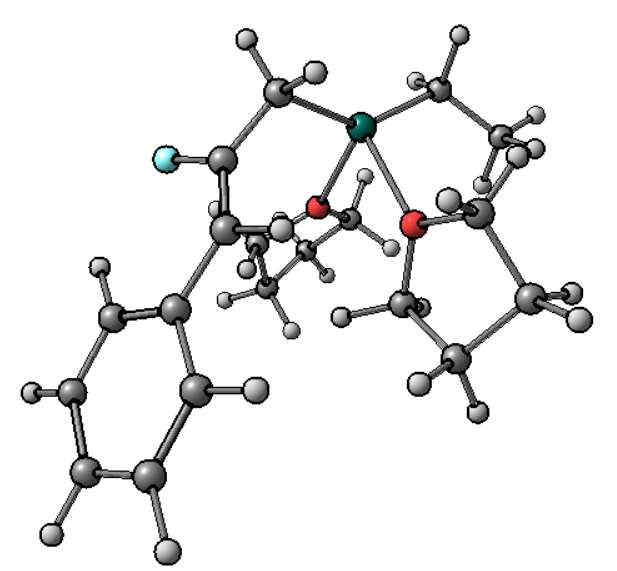
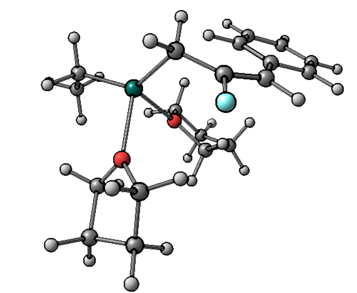

Начал считать, оптимизировать. Сначала построил модель недостаточно оптимально, во время оптимизации одна молекула THF отсоелинилась. Вывод - изначально стоит строить максимально похоже на ожидаемый результат.

2' + 2THF:

Z-2 + 2THF:

E-2 + 2THF:

$\eta_3$: Возникли трудности, изначльно было координировано 2 THF, но при оптимизации структура деформировалась так, что цинк был связан с одни углеродом обычной $\sigma$-связью. Подумав, понял, что по правилу 18e у цинка должен быть один THF. Поставил моделироваться. Та же проблема. Было решено законстрейнить связи Zn-C, запустить оптимизацию, а потом оптимизировать полученную структуру без констрейнов. При этом та же самая ситуация ⇒ $\eta_3$-состояние не выгодно ⇒ его нет в продуктах

Использовать crest для конф. поиска.

При запуске конф. поиска crest говорит, что может дооптимизировать наши стурктуры, нам это не надо(оптимизировали их на предыдущем шаге), значит ставим флаг --noreftopo. Падает с ошибкой Segmentation fault - пока непонятно, что делать.