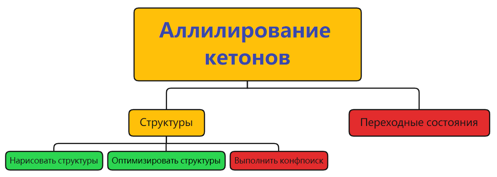
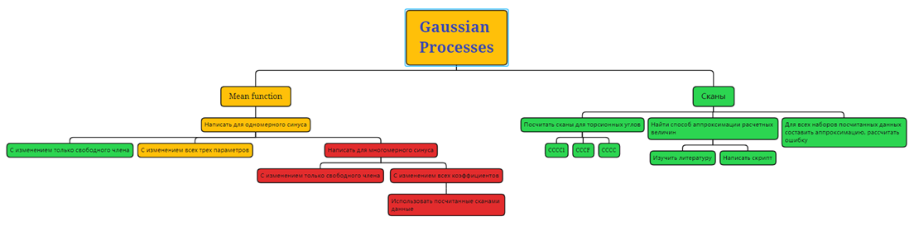

## Аллилирование кетонов

### Структуры:

- [x] Нарисовать структуры
- - [x] Разобраться с $\eta_3$
- [x] Оптимизировать их
- [ ] Выполнить конф. поиск

## [Гауссовы процессы](gaussian_processes)

### [Сканы](scans):
- [x] Посчитать сканы
- [x] CCCC
- [x] CCCF
- [x] CCCCl
- [x] Найти методику аппрокисмации полученных данных
- [x] Посчитать аппроксимации
### [Mean function](mean_func):
- [x] Мономерная для свободного коэффициента
- [ ] Мономерная для всех коэффициентов
- [ ] Многомерная для свободного коэффициента
- [ ] Многомерная для всех коэффициентов
